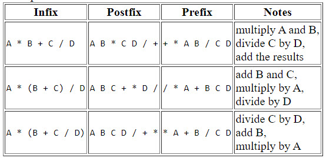

# Infix, Postfix and Prefix
Infix, Postfix and Prefix notations are three different but equivalent ways of writing expressions.

## Infix notation: X + Y
**Operators are written in-between their operands.** This is the usual way we write expressions. An expression such as A * ( B + C ) / D is usually taken to mean something like: "First add B and C together, then multiply the result by A, then divide by D to give the final answer."
Infix notation needs extra information to make the order of evaluation of the operators clear: rules built into the language about operator precedence and associativity, and brackets ( ) to allow users to override these rules. For example, the usual rules for associativity say that we perform operations from left to right, so the multiplication by A is assumed to come before the division by D. Similarly, the usual rules for precedence say that we perform multiplication and division before we perform addition and subtraction. (see CS2121 lecture).

## Postfix notation (also known as "Reverse Polish notation"): X Y +
**Operators are written after their operands.** The infix expression given above is equivalent to A B C + * D /
The order of evaluation of operators is always left-to-right, and brackets cannot be used to change this order. Because the "+" is to the left of the " * " in the example above, the addition must be performed before the multiplication.
Operators act on values immediately to the left of them. For example, the "+" above uses the "B" and "C". We can add (totally unnecessary) brackets to make this explicit:
( (A (B C +) * ) D /)
Thus, the "* " uses the two values immediately preceding: "A", and the result of the addition. Similarly, the "/" uses the result of the multiplication and the "D".

## Prefix notation (also known as "Polish notation"): + X Y
**Operators are written before their operands.** The expressions given above are equivalent to / * A + B C D
As for Postfix, operators are evaluated left-to-right and brackets are superfluous. Operators act on the two nearest values on the right. I have again added (totally unnecessary) brackets to make this clear:
(/ (* A (+ B C) ) D)
Although Prefix "operators are evaluated left-to-right", they use values to their right, and if these values themselves involve computations then this changes the order that the operators have to be evaluated in. In the example above, although the division is the first operator on the left, it acts on the result of the multiplication, and so the multiplication has to happen before the division (and similarly the addition has to happen before the multiplication).
Because Postfix operators use values to their left, any values involving computations will already have been calculated as we go left-to-right, and so the order of evaluation of the operators is not disrupted in the same way as in Prefix expressions.

In all three versions, the operands occur in the same order, and just the operators have to be moved to keep the meaning correct. (This is particularly important for asymmetric operators like subtraction and division: A - B does not mean the same as B - A; the former is equivalent to A B - or - A B, the latter to B A - or - B A).

Reference : [Infix, Postfix and Prefix](http://www.cs.man.ac.uk/~pjj/cs212/fix.html)
